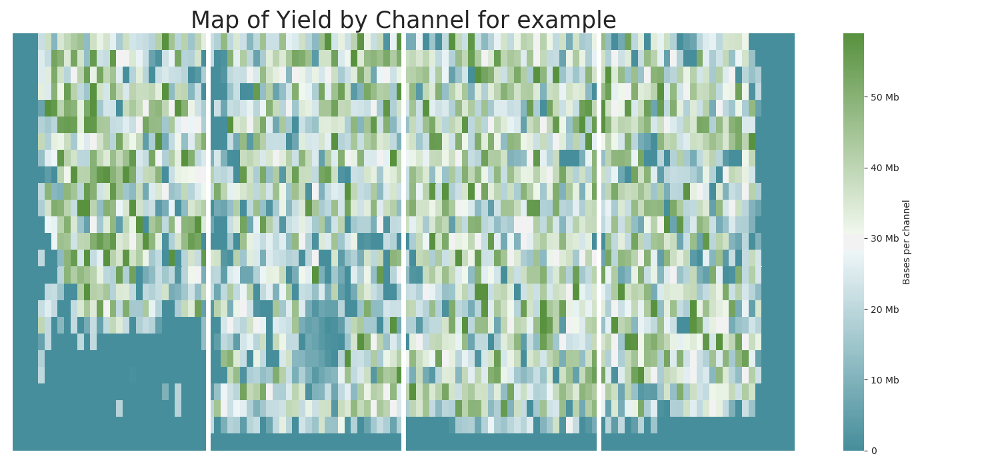

# Betaduck
For data-handling on the PromethION beta device.

## Uses
* Bundle fast5 folds into gzipped tar files
* Gzip fastq files and move to folder 'fastq'
* Move sequencing summary files to folder 'sequencing_summary'

* Plot datasets using the fastq and sequencing summary files. And provide a stats report. Examples of some  plots produced are shown below.
  + Yield produced over time

  + Histogram of read-length distribution

  + Show the distribution in average read quality

  + Pair plot, showing the correlation between four variables provided for each read

  + Yield per channel as provided in the flowcell map.

## Installation through Docker.

### Benefits of running through Docker.
* Restrict memory and so that concurrent sequencing runs are not compromised.
* Version controlling for specific versions of MinKNOW
* Prerequisites are installed for you.
  * You will still need to install docker

### Downloading and installing Docker.
There is no need to repeat what the internet has already provided
[Click here](https://www.digitalocean.com/community/tutorials/how-to-install-and-use-docker-on-ubuntu-16-04) to see a nice straight forward guide to downloading docker.

You may need to log out and log back in again for the super user permissions to take place. If that is not feasible, you may need to precede the docker commands below with `sudo`

### Installing betaduck from docker
`docker pull alexiswl/betaduck:18.07.1-3`  
18.07.1-3 represents the current MinKNOW version.

## Tidying and compressing files

### betaduck config 
First we'll generate the config file. This is used as an input in the next command as to which files and folders to work on.  

For assistance with options use  
`docker run alexiswl/betaduck config --help`

**betaduck config parameters**
* --sequencing_summary_path
  + Contains all the summary.txt files from guppy/dogfish
  + Likely to be `/data/basecalled/<sample>/<flowcell_port>/`
* --fastq_path
  + Contains all of the output .fastq files
  + Likely to be `/data/basecalled/<sample>/<flowcell_port>/`
* --fast5_path
  + Contains a list of subfolders, each containing fast5 files
  + Likely to be `/data/basecalled/<sample>/<flowcell_port>/reads`
* --output_yaml_file
  + Output config file generated. To be used in next script.  
  + Likely to be `/data/basecalled/<sample>/<flowcell_port>/config.yaml`
* --sanitiser
  + Run the fastq sanitiser script before generating the config file.  

**docker parameters**  
You will also need to bind the /data volume to the container when executing the script.
Example:  
`docker run --volume /data:/data alexiswl/betaduck config ..parameters`

### betaduck tidy 
Most of the hard work has been done for us in the previous script.  

**betaduck tidy parameters**

* --config
  + Path to config file generated in the previous script
* --keep
  + Should we keep the original files
* --dry_run          
  + Don't actually run the subcommands. Just pretend.
* --overwrite        
  + Overwrite files if they already exist
* --threads
  + Number of folders to tar and zip simultaneously (default=1)
  
**docker parameters**  
Here is where docker shines, it can restrict the cpus and memory utilisations of a given container as to not blow up your system.  
Having said that, the PromethION beta device is pretty powerful machine. It has 96 cpus with 400 Gb of memory and all of this on SSD drives.
Use the `top` and `free` commands to view the current utilisations of your system.  
The `--cpus` parameter should be 1 higher than the `--threads` parameter used by betaduck.  
Example:  
`docker run --memory=50g --cpus=7 --volume=/data:/data alexiswl/betaduck tidy ..parameters`

## Plotting datasets with betaduck
Now we get our rewards, some plots produced from the seaborn and matplotlib libraries

**betaduck plot parameters**

* --summary_dir 
  + Where the tidy command placed the summary files.
  + Likely `/data/basecalled/<sample>/<flowcell_port>/sequencing_summary/`
* --fastq_dir 
  + Where the tidy command placed the fastq files.
  + Likely `/data/basecalled/<sample>/<flowcell_port>/fastq`
* --name 
  + Name used in plots
  + Keep this to 10 characters or less
     + fig.tight_layout() is still in development.
* --plots_dir 
  + Where do you want to put these plots
  + Likely `/data/basecalled/<sample>/<flowcell_port>/plots`
* --threads
  + Number of threads to use when reading in fastq and summary datasets.
  + Number of threads used when generating the plots has been restricted to 1.

## Troubleshooting
* Info logs display in UTC time
  + Docker containers use the time of the container, not that of the outside.
  + You can fix this by mounting the /etc/localtime into the container
  + `docker run --volume /data:/data --volume /etc/localtime:/etc/localtime alexiswl/betaduck ..parameters`
